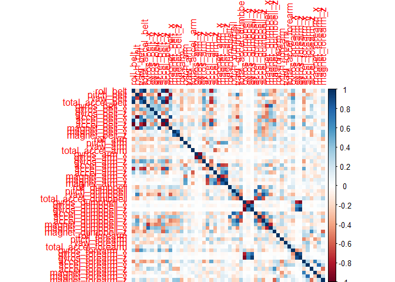
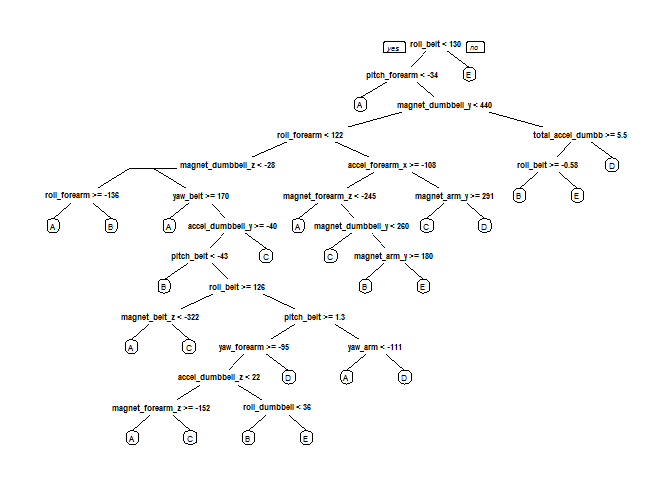

Johns Hopkins | Coursera - Machine Learning Project
===================================================

Introduction
------------

Using devices such as Jawbone Up, Nike FuelBand, and Fitbit it is now possible to collect a large amount of data about personal activity relatively inexpensively. These type of devices are part of the quantified self movement - a group of enthusiasts who take measurements about themselves regularly to improve their health, to find patterns in their behavior, or because they are tech geeks. One thing that people regularly do is quantify how much of a particular activity they do, but they rarely quantify how well they do it.

In this project, we will use data from accelerometers on the belt, forearm, arm, and dumbell of 6 participants to predict the manner in which they did the exercise.

Data Preprocessing
------------------

### Load the relevant libraries

``` r
library(caret)
library(rpart)
library(rpart.plot)
library(randomForest)
library(corrplot)
```

### Download the data

``` r
trainUrl <-"https://d396qusza40orc.cloudfront.net/predmachlearn/pml-training.csv"
testUrl <- "https://d396qusza40orc.cloudfront.net/predmachlearn/pml-testing.csv"
trainFile <- "./data/pml-training.csv"
testFile  <- "./data/pml-testing.csv"
if (!file.exists("./data")) {
  dir.create("./data")
}
if (!file.exists(trainFile)) {
  download.file(trainUrl, destfile=trainFile)
}
if (!file.exists(testFile)) {
  download.file(testUrl, destfile=testFile)
}
```

### Read the data

``` r
# Replace blank values with NA
trainRaw <- read.csv("./data/pml-training.csv", na.strings = c("", NA))
testRaw <- read.csv("./data/pml-testing.csv", na.strings = c("", NA))
dim(trainRaw)
```

    ## [1] 19622   160

``` r
dim(testRaw)
```

    ## [1]  20 160

### Clean the data

``` r
sum(complete.cases(trainRaw))
```

    ## [1] 406

``` r
table(colSums(is.na(trainRaw)))
```

    ## 
    ##     0 19216 
    ##    60   100

There are 100 columns out of 160 where out of 19622 observations, 19216 have NA values, thus only 406 observations have values other than NA for these columns, 406/19622 is approx. 2% of the data, so we can afford to drop these 100 columns.

``` r
trainRaw <- trainRaw[, colSums(is.na(trainRaw)) == 0] 
testRaw <- testRaw[, colSums(is.na(testRaw)) == 0] 
```

Now, let's clean the data off the variables that are of no use for predictions.

``` r
classe <- trainRaw$classe
trainRemove <- grepl("^X|timestamp|window|user_name", names(trainRaw))
trainCleaned <- trainRaw[, !trainRemove]
testRemove <- grepl("^X|timestamp|window|user_name|problem_id", names(testRaw))
testCleaned <- testRaw[, !testRemove]
```

### Slice the data

We now split the cleaned training set into a pure training data set (70%) and a validation data set (30%). We will use the validation data set to conduct cross validation.

``` r
set.seed(1977) # For reproducibile purposes
inTrain <- createDataPartition(trainCleaned$classe, p=0.70, list=F)
trainData <- trainCleaned[inTrain, ]
testData <- trainCleaned[-inTrain, ]
```

Data Modeling
-------------

We fit a predictive model for activity recognition using Random Forest algorithm because it automatically selects important variables and is robust to correlated covariates & outliers in general. We will use 5-fold cross validation when applying the algorithm. (Wanted to try 10-fold CV with 3 repetitions but it was taking too much of time.)

``` r
controlRf <- trainControl(method="cv", number=5)
modelRf <- train(classe ~ ., data=trainData, method="rf", trControl=controlRf, ntree=250)
modelRf
```

    ## Random Forest 
    ## 
    ## 13737 samples
    ##    52 predictor
    ##     5 classes: 'A', 'B', 'C', 'D', 'E' 
    ## 
    ## No pre-processing
    ## Resampling: Cross-Validated (5 fold) 
    ## Summary of sample sizes: 10991, 10989, 10990, 10989, 10989 
    ## Resampling results across tuning parameters:
    ## 
    ##   mtry  Accuracy   Kappa    
    ##    2    0.9903907  0.9878442
    ##   27    0.9906817  0.9882126
    ##   52    0.9872605  0.9838859
    ## 
    ## Accuracy was used to select the optimal model using  the largest value.
    ## The final value used for the model was mtry = 27.

Next, We estimate the performance of the model on the validation data set.

``` r
predictRf <- predict(modelRf, testData)
confusionMatrix(testData$classe, predictRf)
```

    ## Confusion Matrix and Statistics
    ## 
    ##           Reference
    ## Prediction    A    B    C    D    E
    ##          A 1672    2    0    0    0
    ##          B    6 1131    2    0    0
    ##          C    0    2 1022    2    0
    ##          D    0    0   15  948    1
    ##          E    0    0    3    2 1077
    ## 
    ## Overall Statistics
    ##                                           
    ##                Accuracy : 0.9941          
    ##                  95% CI : (0.9917, 0.9959)
    ##     No Information Rate : 0.2851          
    ##     P-Value [Acc > NIR] : < 2.2e-16       
    ##                                           
    ##                   Kappa : 0.9925          
    ##  Mcnemar's Test P-Value : NA              
    ## 
    ## Statistics by Class:
    ## 
    ##                      Class: A Class: B Class: C Class: D Class: E
    ## Sensitivity            0.9964   0.9965   0.9808   0.9958   0.9991
    ## Specificity            0.9995   0.9983   0.9992   0.9968   0.9990
    ## Pos Pred Value         0.9988   0.9930   0.9961   0.9834   0.9954
    ## Neg Pred Value         0.9986   0.9992   0.9959   0.9992   0.9998
    ## Prevalence             0.2851   0.1929   0.1771   0.1618   0.1832
    ## Detection Rate         0.2841   0.1922   0.1737   0.1611   0.1830
    ## Detection Prevalence   0.2845   0.1935   0.1743   0.1638   0.1839
    ## Balanced Accuracy      0.9980   0.9974   0.9900   0.9963   0.9990

``` r
accuracy <- postResample(predictRf, testData$classe)
accuracy
```

    ##  Accuracy     Kappa 
    ## 0.9940527 0.9924767

``` r
1 - as.numeric(confusionMatrix(testData$classe, predictRf)$overall[1])
```

    ## [1] 0.005947324

The accuracy of the model is 99.45% and and out of sample error is 0.54%.

Prediction
----------

Predicting the data downloaded earlier with 20 observations.

``` r
result <- predict(modelRf, testCleaned)
result
```

    ##  [1] B A B A A E D B A A B C B A E E A B B B
    ## Levels: A B C D E

Appendix: Graphs
----------------

Corelation Matrix

``` r
corrPlot <- cor(trainData[, -length(names(trainData))])
corrplot(corrPlot, method="color")
```



Decision Tree Visualization

``` r
treeModel <- rpart(classe ~ ., data=trainData, method="class")
prp(treeModel) # fast plot
```


